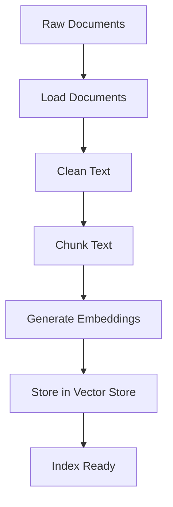
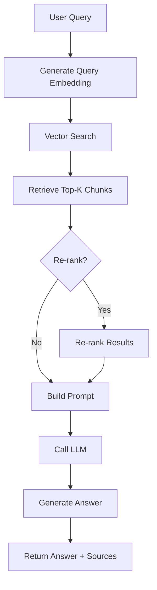

# RAG Pipeline Architecture

## Component Architecture

The RAG pipeline is organized into three main layers:

### 1. Utilities Layer (`src/utils/`)

Reusable utilities used throughout the system:

- **config.py**: Configuration management
- **logging_utils.py**: Structured logging
- **io_utils.py**: File I/O operations
- **validation.py**: Input validation
- **llm_utils.py**: LLM interaction wrappers
- **embeddings.py**: Embedding generation
- **rag_preprocessing.py**: Text cleaning and chunking

### 2. RAG Pipeline Layer (`src/rag/`)

Core RAG components:

- **pipelines.py**: High-level orchestration
- **index_builder.py**: Index construction
- **retriever.py**: Document retrieval
- **re_ranker.py**: Result re-ranking
- **prompt_builder.py**: Prompt construction
- **inference.py**: End-to-end query processing
- **evaluation.py**: Performance metrics

### 3. Storage Layer (`src/rag/storage/`)

Vector store abstractions:

- **vector_store.py**: Abstract interface
- **InMemoryVectorStore**: In-memory implementation (for testing)
- **PineconeVectorStore**: Pinecone integration (placeholder)
- **FAISSVectorStore**: FAISS integration (placeholder)
- **ChromaVectorStore**: Chroma integration (placeholder)

## Data Flow

### Indexing Flow



### Query Flow



## Module Dependencies

```
utils/
├── config.py (no dependencies)
├── logging_utils.py (no dependencies)
├── io_utils.py (no dependencies)
├── validation.py (no dependencies)
├── llm_utils.py (depends on: config)
├── embeddings.py (depends on: config)
└── rag_preprocessing.py (no dependencies)

rag/
├── pipelines.py (depends on: index_builder, inference)
├── index_builder.py (depends on: utils/*, storage)
├── retriever.py (depends on: utils/*, storage)
├── re_ranker.py (depends on: utils/*)
├── prompt_builder.py (depends on: utils/*)
├── inference.py (depends on: retriever, re_ranker, prompt_builder, utils/*)
└── evaluation.py (no dependencies)
```

## Design Principles

1. **Separation of Concerns**: Each module has a single, well-defined responsibility
2. **Dependency Injection**: Components accept dependencies rather than creating them
3. **Interface Abstraction**: Vector stores and LLMs are abstracted behind interfaces
4. **Configuration-Driven**: Behavior controlled through configuration, not code changes
5. **Testability**: All components are designed to be easily testable with mocks

## Extension Points

### Adding a New Vector Store

1. Implement the `VectorStore` interface
2. Add factory method in `vector_store.py`
3. Update configuration options

### Adding a New LLM Provider

1. Add provider-specific function in `llm_utils.py`
2. Update `call_llm()` to handle new provider
3. Add configuration options

### Adding a New Chunking Strategy

1. Implement chunking function in `rag_preprocessing.py`
2. Add strategy option to `chunk_text()`
3. Update documentation

